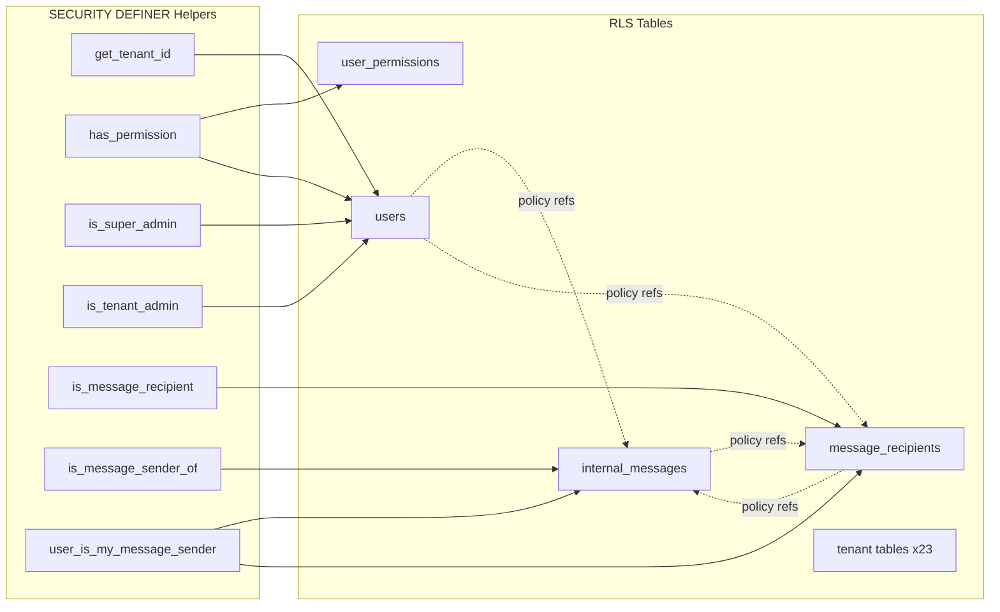

# MASH ISP — RLS Graph

> خريطة Row Level Security: policies، التبعيات، ونقاط recursion المعروفة.  
> **يُحدَّث إلزامياً** عند أي migration تلمس policies أو helpers أمنية.

---

## Global Helpers (SECURITY DEFINER)

```
get_tenant_id()          ← reads users WHERE id = auth.uid()
has_permission()         ← reads user_permissions JOIN users
is_super_admin()         ← reads users
is_tenant_admin()        ← reads users
is_message_recipient()   ← reads message_recipients  [019]
is_message_sender_of()   ← reads internal_messages   [019]
user_is_my_message_sender() ← reads internal_messages JOIN message_recipients [019]
```

**قاعدة:** helpers تستخدم `SECURITY DEFINER` + `SET search_path = public` لتجنب recursion عند استدعائها من policies.

---

## Standard Tenant Isolation Pattern

```
┌─────────────────────────────────────────┐
│  authenticated client                   │
└─────────────────┬───────────────────────┘
                  │
                  ▼
┌─────────────────────────────────────────┐
│  Policy: tenant_id = get_tenant_id()    │  ← 23 ISP tables + most SaaS reads
└─────────────────┬───────────────────────┘
                  │
                  ▼
┌─────────────────────────────────────────┐
│  get_tenant_id() [SECURITY DEFINER]     │  ← bypasses RLS on users
└─────────────────────────────────────────┘
```

---

## users — Policy Graph (5 policies)

| Policy | Migration | Operation | Condition |
|--------|-----------|-----------|-----------|
| `users_tenant_select` | 002 | SELECT | `tenant_id = get_tenant_id()` |
| `users_superadmin_all` | 002 | ALL | `is_super_admin()` |
| `users_admin_manage` | 007 | ALL | `is_tenant_admin()` + same tenant + role ∈ {admin, employee} |
| `users_read_self` | 012 | SELECT | `id = auth.uid()` |
| `users_message_sender_read` | 011 → **019** | SELECT | `user_is_my_message_sender(id)` |

### ⚠️ Recursion History (011 → 019)

**قبل 019 (011):**
```
users policy → EXISTS(internal_messages JOIN message_recipients)
                    ↓
internal_messages policy → EXISTS(message_recipients)
                    ↓
message_recipients policy → EXISTS(internal_messages)
                    ↓
                    ∞ RECURSION
```

**بعد 019:**
```
users policy → user_is_my_message_sender() [SECURITY DEFINER — no RLS loop]
internal_messages recipient policy → is_message_recipient() [SECURITY DEFINER]
message_recipients sender policy → is_message_sender_of() [SECURITY DEFINER]
```

**Checklist قبل policy جديدة على `users`:** هل تستدعي جدولاً له policy يستدعي `users`؟

---

## user_permissions — Policy Graph

| Policy | Migration | Operation | Condition |
|--------|-----------|-----------|-----------|
| `user_permissions_tenant_select` | 002 | SELECT | employee in same tenant |
| `user_permissions_superadmin_all` | 002 | ALL | super_admin |
| `user_permissions_admin_manage` | 007 | ALL | admin + target is employee in tenant |

**Client path:** mutations عبر `set_employee_permission()` (018) — لا INSERT/DELETE مباشر.

---

## internal_messages — Policy Graph

| Policy | Operation | Condition |
|--------|-----------|-----------|
| `internal_messages_sender_read` | SELECT | `sender_id = auth.uid()` |
| `internal_messages_recipient_read` | SELECT | `is_message_recipient(id)` **[019]** |
| `internal_messages_superadmin_read` | SELECT | `is_super_admin()` |

**Insert:** عبر send RPCs فقط (`_dispatch_internal_message` — SECURITY DEFINER).

---

## message_recipients — Policy Graph

| Policy | Operation | Condition |
|--------|-----------|-----------|
| `message_recipients_own_select` | SELECT | `recipient_user_id = auth.uid()` |
| `message_recipients_sender_select` | SELECT | `is_message_sender_of(message_id)` **[019]** |
| `message_recipients_superadmin_select` | SELECT | `is_super_admin()` |
| `message_recipients_mark_read` | UPDATE | own row only |

**Realtime:** `ALTER PUBLICATION supabase_realtime ADD TABLE message_recipients` (010).

---

## Messaging Read Path (Client)

```
❌ Avoid: PostgREST embed internal_messages ← message_recipients
   (RLS + null embed — fixed reactively in 015)

✅ Use RPC:
   get_my_inbox()
   get_my_sent_messages()
   get_my_unread_message_count()
   peek_inbox_message()
```

---

## audit_logs — Restricted Pattern

| Policy | Operation | Who |
|--------|-----------|-----|
| `audit_logs_insert` | INSERT | authenticated (trigger-driven) |
| `audit_logs_admin_read` | SELECT | tenant admin |
| `audit_logs_superadmin_all` | ALL | super_admin |

**No UPDATE/DELETE** — append-only audit trail.

---

## subscription_plans — Public Read

| Policy | Condition |
|--------|-----------|
| `plans_read_active` | `is_active OR is_coming_soon` |
| `plans_write_superadmin` | super_admin only |

---

## Tables: FORCE RLS Summary

**30 جدول original (002)** + `card_retail_sales` (008) + `distributors` (009) + messaging (010) = **33 جدول** with FORCE RLS.

---

## Cross-Table Dependency Map



**Legend:** solid = helper reads table bypassing RLS; dotted = policy references (must use helpers to avoid loops).

---

## RLS Change Checklist (PR)

- [ ] هل Policy جديدة تستدعي EXISTS على جدول له policy يعود لنفس الجدول؟
- [ ] هل cross-table check يحتاج SECURITY DEFINER helper؟
- [ ] هل `search_path = public` مضبوط على الدالة؟
- [ ] هل GRANT/REVOKE صحيح؟
- [ ] هل Client يستخدم RPC بدلاً من embed إن كان join معقداً؟
- [ ] تحديث هذا الملف + `RPC_CATALOG.md`

---

## Known Risk Areas

| Area | Risk | Mitigation |
|------|------|------------|
| `users` policies | High — hub table | helpers only for cross-ref |
| Messaging triple | Was infinite recursion | 019 pattern — don't revert to EXISTS |
| `user_permissions` direct client write | RLS + duplicate key | RPC 018 |
| Admin suspend | RLS on users UPDATE | RPC 019 |

---

## Testing RLS Changes

```bash
# integration tests — see TESTING.md
TEST_TENANT_A_JWT=... npm test
```

**Manual smoke after policy change:**

1. Login as employee → inbox loads via `get_my_inbox`
2. Login as admin → suspend employee via `suspend_tenant_employee`
3. Login as recipient → sender name visible (super_admin message)
4. Verify no `infinite recursion detected in policy` in Supabase logs
